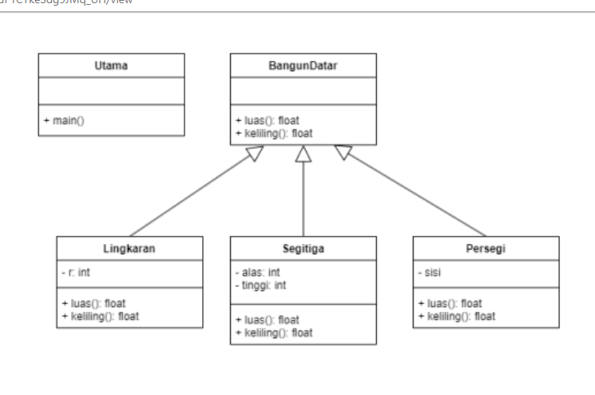
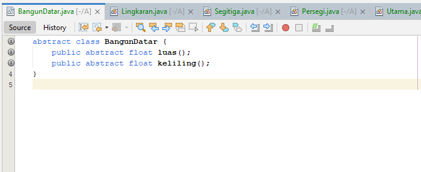
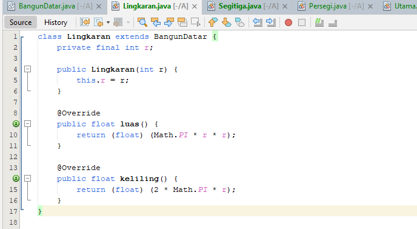
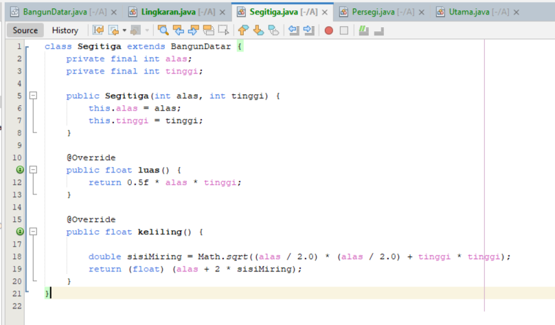
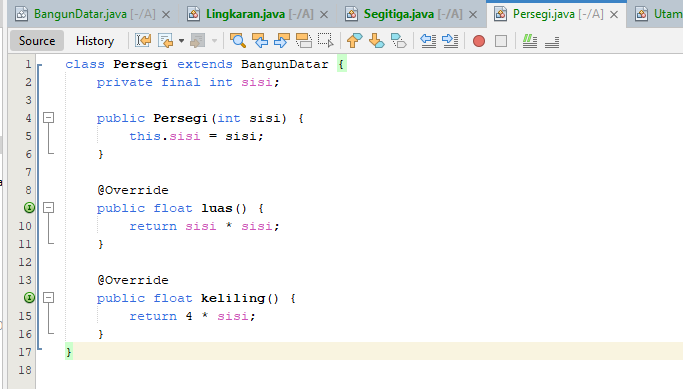
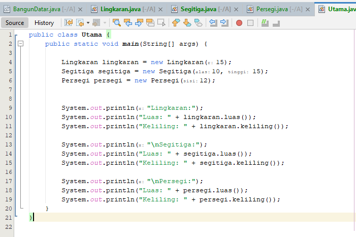
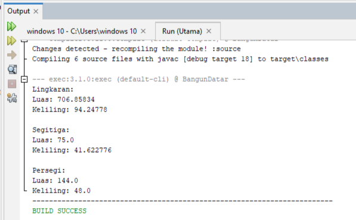
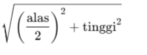
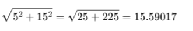

# Praktikum4

# Implementasi Diagram Class 

# Penjelasannya

.

# 1.  *Class Bangun Datar*
    • Fungsi: BangunDatar adalah Class abstrak yang menjadi dasar bagi berbagai bentuk dua dimensi seperti lingkaran, segitiga, dan persegi.

    • Isi: Class ini memiliki dua metode abstrak:
   
    • luas(): Mengembalikan nilai float dari luas bentuk.
    
    • keliling(): Mengembalikan nilai float dari keliling bentuk.
    
    • Tujuan: Karena kelas ini abstrak, ia tidak dapat di-instantiate (dibuat objeknya) secara langsung. 
     Kelas ini digunakan sebagai dasar (parent class) untuk bentuk-bentuk lain yang akan mengimplementasikan cara khusus untuk menghitung luas dan keliling masing-masing bentuk.

.
    
# 2.  *Class Lingkaran*
    • Fungsi: Class Lingkaran adalah subclass (turunan) dari BangunDatar dan mengimplementasikan metode luas() dan keliling() khusus untuk lingkaran.
  
    • Isi:
      • Atribut:
        • r: Integer yang menyimpan jari-jari lingkaran.
    
      • Metode:
        • luas(): Menghitung luas lingkaran menggunakan rumus 𝜋 x 𝑟².     
        • keliling(): Menghitung keliling lingkaran menggunakan rumus 2 x π x r.
 
    • Tujuan: Untuk menghitung luas dan keliling dari lingkaran berdasarkan jari-jari yang diberikan.

.

# 3.  *Class Segitiga*
    • Fungsi: Class Segitiga adalah subclass dari BangunDatar dan mengimplementasikan metode luas() dan keliling() khusus untuk segitiga.
   
    • Isi:
      • Atribut:
        • alas: Integer yang menyimpan panjang alas segitiga.
        • tinggi: Integer yang menyimpan tinggi segitiga.
    
      • Metode:
        • luas(): Menghitung luas segitiga dengan rumus 0.5 x alas x tinggi
        • keliling(): Menghitung keliling segitiga dengan asumsi segitiga sama kaki,
        menggunakan rumus: alas + 2 x sisiMiring, di mana sisiMiring dihitung dengan Teorema Pythagoras.
    
    • Tujuan: Untuk menghitung luas dan keliling dari segitiga dengan asumsi segitiga sama kaki.

.

# 4.  *Class Persegi*
    • Fungsi: Class Persegi adalah subclass dari BangunDatar dan mengimplementasikan metode luas() dan keliling() khusus untuk persegi.
  
    • Isi:
      • Atribut:
        • sisi: Integer yang menyimpan panjang sisi persegi.
    
      • Metode:
        • luas(): Menghitung luas persegi dengan rumus sisi x sisi
        • keliling(): Menghitung keliling persegi dengan rumus 4 x sisi
   
    • Tujuan: Untuk menghitung luas dan keliling dari persegi berdasarkan panjang sisi yang diberikan.

.

# 5.  *Class Utama*
    • Fungsi: Class ini adalah titik masuk utama (main class) dari program, di mana program akan dijalankan. Kelas ini mengandung metode main() yang menjalankan keseluruhan kode.
    
    • Isi:
      • Metode main():
        • Membuat objek dari Lingkaran, Segitiga, dan Persegi dengan parameter yang berbeda.
        • Menampilkan hasil perhitungan luas() dan keliling() untuk setiap objek yang dibuat.
    
    • Tujuan: Untuk menguji fungsi dari setiap bentuk dengan menampilkan luas dan keliling dari masing-masing bentuk.

.

# 1.  *Lingkaran*  dengan r = 15
    • Luas (Area) dihitung dengan rumus:
                                          luas = π x r²
      Dengan 𝑟 = 15 maka:
                                          luas = 3.14159 x 15² = 706.8577
    • Keliling (Circumference) dihitung dengan rumus:
                                          keliling = 2 x 𝜋 x 𝑟
      Dengan 𝑟 = 15, maka:
                                          keliling = 2 x 3.14159 x 15 = 94.24778
Hasil:
  • Luas: 706.8577
  • Keliling: 94.24778

# 2.  *Segitiga*  dengan alas = 10 dan tinggi = 15
  *Asumsi bahwa segitiga adalah segitiga sama kaki dengan tinggi 15 dan alas 10.*
    • Luas (Area) dihitung dengan rumus:

                                          luas = 0.5 x alas x tinggi
      Dengan alas = 10 dan tinggi = 15, maka:
                                          luas = 0.5 x 10 x 15 = 75.0
    • Keliling (Perimeter) dihitung dengan asumsi segitiga sama kaki:

      1. Hitung panjang sisi miring (hypotenuse), yang merupakan panjang dari alas ke ujung tertinggi segitiga. Dengan menggunakan rumus Pythagoras:
 sisiMiring = 
             .
      Dengan alas = 10 dan tinggi = 15
 sisiMiring = 
              .
      2. Hitung keliling dengan menambahkan alas dan dua kali panjang sisi miring:
                                          keliling = alas + 2 x sisiMiring = 10 + 2 x 15.59017 = 41.18034
Hasil:
  • Luas: 75.0
  • Keliling: 41.18034

# 3.  *Persegi*  dengan sisi = 12
    • Luas (Area) dihitung dengan rumus:
                                         luas = sisi x sisi
      Dengan sisi = 12, maka:
                                          luas = 12 x 12 = 144.0
    • Keliling (Perimeter) dihitung dengan rumus:
                                          keliling = 4 x sisi
      Dengan sisi = 12, maka:
                                          keliling = 4 x 12 = 48.0
Hasil:
  • Luas: 144.0
  • Keliling: 48.0
